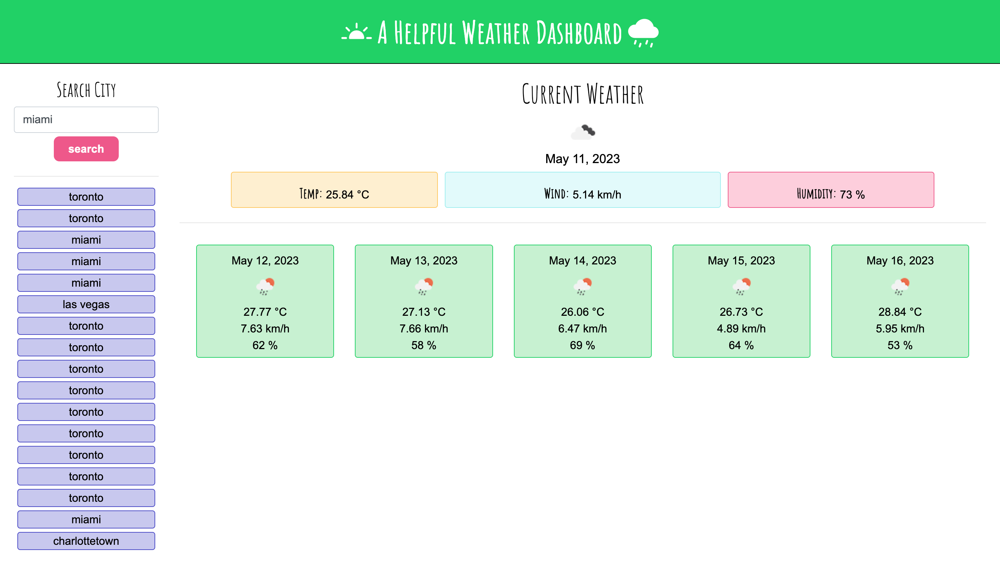
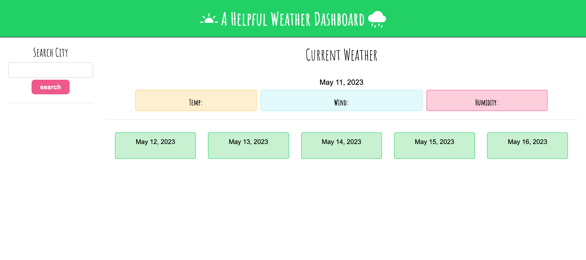

# A Helpful Weather Dashboard | Challenge 06

## Description

A weather dashboard was developed using the Open Weather Map API. The user is able to search by city name and have the current weather and five day forecast display for that city. 

A history of past searches is recorded to local storage, and the user can click on any past search to show the weather for that city again.

- the user enters a city name in search, and the API is accessed
- the javascript converts the city name to longitude and latitude in order to receive data
- the weather is displayed for today and the next five days
- the user can look at any past searches by clicking on the city name in the side bar

## Tech Used

- HTML
- Bootstrap
- Open Weather API
- JavaScript

## Usage

File can used and shared to for knowledge expansion or usage as needed. 

## Credit

APIs:

- Open Weather (https://openweathermap.org/api)

## License

- GitHub repository URL: https://github.com/cherah-petra/A-Helpful-Weather-Dashboard
- GitHub Page: https://cherah-petra.github.io/A-Helpful-Weather-Dashboard/
- License: license.txt

